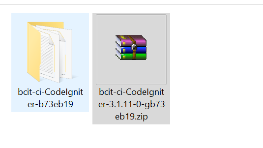
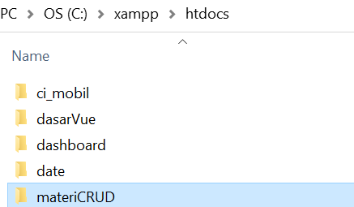
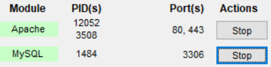
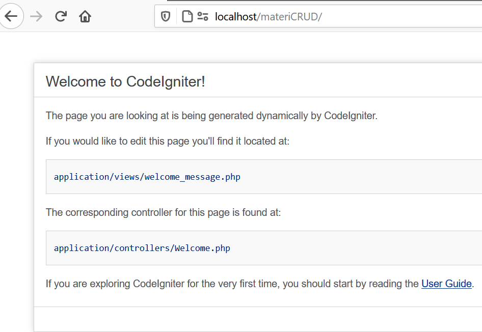
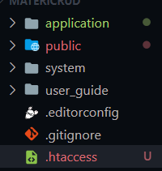
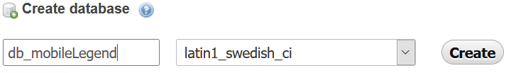
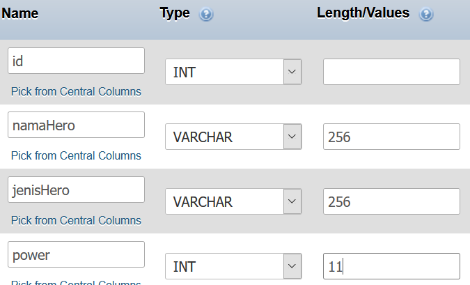
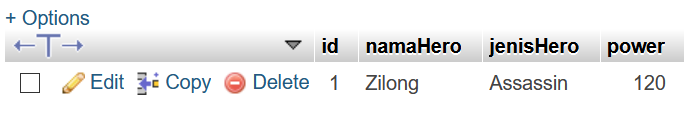

# Materi Pemrograman Web dengan menggunakan Codeigniter 3
#### **Author : Prasetyo Bella Ramadhanu**
> Experiencing is the best way to really understand what real programming.

Projek pemrograman web ini dibangun dengan menggunakan bahasa **PHP**, dengan framework **CodeIgniter** serta menggunakan **MySQL** sebagai databasenya. Projek ini memiliki fitur yaitu CRUD (CREATE, READ, UPDATE, DELETE). Tujuan dibuatkan projek ini adalah sebagai sarana belajar ilmu tentang dunia coding. Projek ini bersifat bebas dan dapat dipergunakan kembali untuk sarana belajar atau apapun. Projek ini ditunjukkan kepada bagi siapa saja yang ingin belajar seperti mahasiswa, atau masyarakat umum.

## Persiapan Instalasi
Silahkan Download dan Install Software pendukung terlebih dahulu 👍
1. Download Web Server
    * XAMPP | https://www.apachefriends.org/index.html
2. Text Editor
    * Visual Studio Code | https://code.visualstudio.com/
3. File Master CodeIgniter 3
    * CodeIgniter Versi 3 | https://codeigniter.com/download 
4. Browser (Firefox atau Google Chrome)
## Instalasi CodeIgniter
1. Extrack here File **Codeigniter.rar** yang sudah didownload
   
    
2. Pindahkan Folder Codeigniter ke dalam **C:\xampp\htdocs** dan **rename** folder tersebut
   
    
3. Mengaktifkan Web Server XAMPP (MySQL dan Apache)
   
   
4. Menjalankan projek dengan cara buka browser lalu tulis di address bar **http://localhost/materiCRUD/**
   
   

## Konfigurasi Codeigniter
1. Buka File **autoload.php** , yang berada di folder **application/config** lalu setting seperti ini :
   ```php
    $autoload['libraries'] = array('database');

    $autoload['helper'] = array('url');
   ```
2. Buka File **config.php**, yang berada di folder **application/config** lalu setting seperti ini :
   ```php
    $config['base_url'] = 'http://localhost/materiCRUD/';

    $config['index_page'] = '';
   ```
3. Membuat sebuah file di dalam folder utama dengan nama **.htaccess** dan copy code dibawah ini :
   ```.htaccess
    RewriteEngine On
    RewriteCond %{REQUEST_FILENAME} !-f
    RewriteCond %{REQUEST_FILENAME} !-d
    RewriteRule ^(.*)$ index.php/$1 [L]
   ````
   

4. Mengatur Database, dengan cara buka file **database.php** yang berada di **application/config** isi sesuai dengan code berikut :
    ```PHP
        'username' => 'root',
        'password' => '',
        'database' => 'db_mobileLegend',
    ```
## Membuat Database di Php MyAdmin
1. Akses alamat ini di browser **localhost/phpmyadmin/**
2. Buat Database dengan nama **db_mobileLegend**

    
3. Buat table dengan nama **tabelHero**, isi field tabel ada di bawah ini

    
4. Isi sebuah data record pada tabel **tabelHero**

    
5. Menjalankan projek dengan cara buka browser lalu tulis di address bar **http://localhost/materiCRUD/** maka akan muncul seperti ini

    

   
